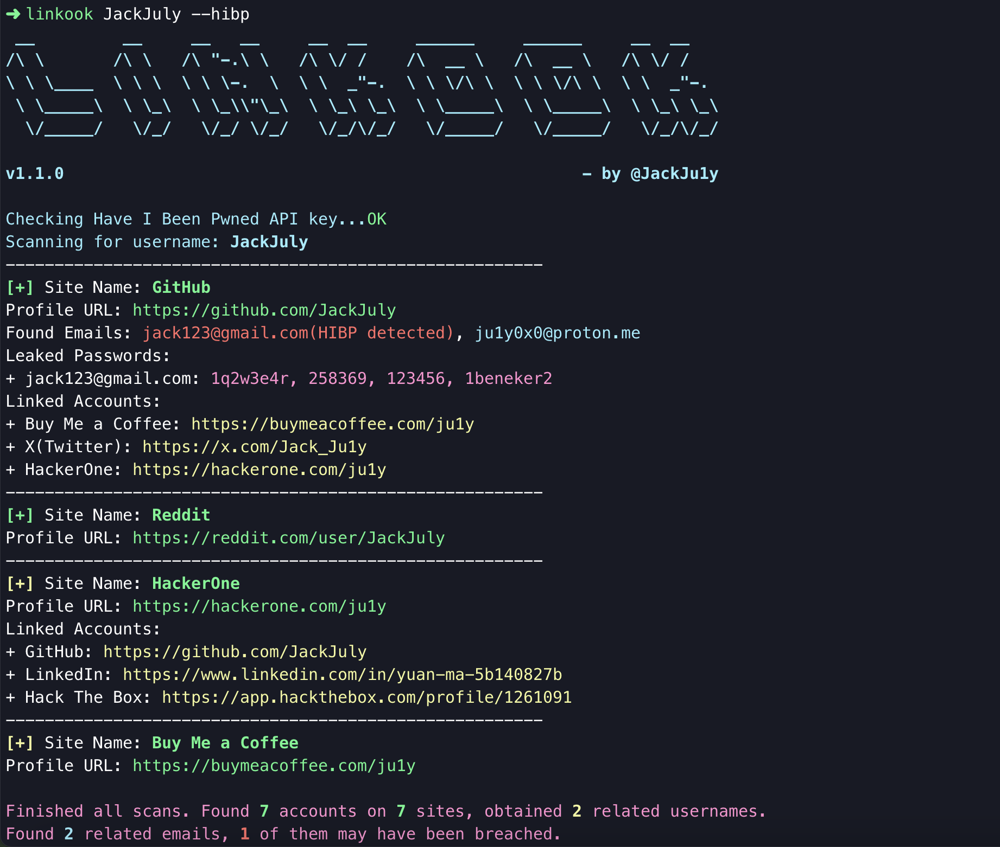
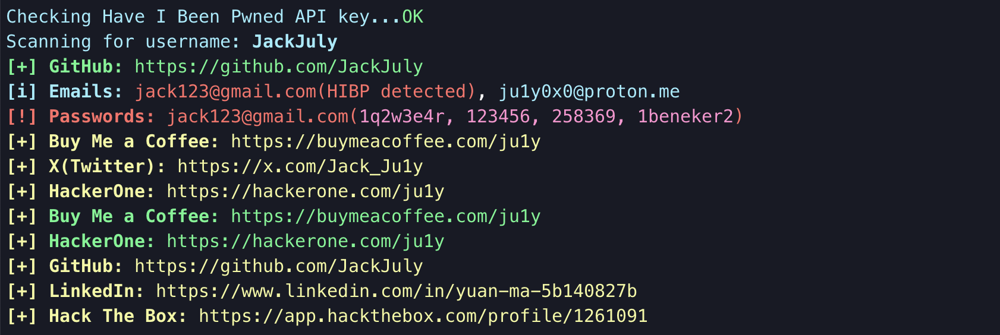

# Linkook

English | [中文](README_zh.md)

**Linkook** is an OSINT tool for discovering **linked/connected** social accounts and associated emails across multiple platforms using a single username. It also supports exporting the gathered relationships in a Neo4j-friendly format for visual analysis.



### Main Features

- Search social media accounts across **multiple platforms** based on a given username.
- Further retrieve **interlinked** social accounts, usernames, emails, and more.
- Use **HudsonRock's Cybercrime Intelligence Database** to check if related emails have been affected by cybercrime or info-stealer infections.
- Support exporting scan results to a Neo4j-friendly JSON format, enabling visual analysis in **Neo4j**.

## Installation

```shell
pipx install linkook
```

or use `pip` instead of `pipx`

### Install manually

You can also use the following commands to install it manually.

1. Download this repo

```shell
git clone https://github.com/JackJuly/linkook
cd linkook
```

2. You can run `Linkook` directly

```shell
python -m linkook {username}
```

3. Or you can install `Linkook`

```shell
python setup.py install
```

### Run Linkook

```shell
linkook {username}
```

## Usage

### `--show-summary`

Choose whether to display a summary of the scan results.


### `--concise`

Choose whether to display the output in a concise format.



### `--check-breach`

Use HudsonRock's Cybercrime Intelligence Database to check whether the discovered email addresses have been compromised by cybercrime or info-stealing. If any data breach is found, the email address will be highlighted in red with '(breach detected)' in the output, and all detected emails will be listed in the Scan Summary.

```
...
Found Emails: notbreached@mail.com, breached@mail.com(breach detected)
...
...
========================= Scan Summary =========================
...
Breached Emails: breached@mail.com
```

### `--neo4j`

Export the query results as a JSON file compatible with Neo4j database imports, producing `neo4j_export.json`.

In Neo4j, use the **APOC** plugin to import the JSON data. The following **Cypher** code will import the data and, upon successful execution, return the counts of imported nodes and relationships.

```cypher
CALL apoc.load.json("file:///neo4j_export.json") YIELD value
CALL {
  WITH value
  UNWIND value.nodes AS node
  CALL apoc.create.node(
    node.labels,
    apoc.map.merge({ id: node.id }, node.properties)
  ) YIELD node AS createdNode
  RETURN count(createdNode) AS nodesCreated
}
CALL {
  WITH value
  UNWIND value.relationships AS rel
  MATCH (startNode {id: rel.startNode})
  MATCH (endNode {id: rel.endNode})
  CALL apoc.create.relationship(startNode, rel.type, {}, endNode) YIELD rel AS createdRel
  RETURN count(createdRel) AS relsCreated
}
RETURN nodesCreated, relsCreated;
```

You can use `MATCH (n) RETURN n` to view all results and their connections.


### Other Options

**`--help`**: show help message.

**`--silent`**: Suppress all output and only show summary.

**`--scan-all`**: Scan all available sites in the provider.json file. If not set, only scan sites with `isConnected` set to true.

**`--print-all`**: Output sites where the username was not found.

**`--no-color`**: Output without color.

**`--browse`**: Browse to all found profiles in the default browser.

**`--debug`**: Enable verbose logging for debugging.

**`--output`**: Directory to save the results. Default is `results`.

**`--local`**: Force the use of the local provider.json file, add a custom path if needed. Default is `provider.json`.

## Comparison with Sherlock

[Sherlock](https://github.com/sherlock-project/sherlock) is a great tool that finds social media accounts based on usernames, and this project (Linkook) was partly inspired by it. But Sherlock has some limitations.

- Only searches for the same username on each platform.
- May miss accounts if a user uses different usernames across platforms.
- Can mistakenly include accounts from unrelated users if they share the searched username.

In contrast, **Linkook** can go one step further:

- **Recursively searches** for **linked** accounts from each discovered social account—even if different usernames are used.
- Provides a more comprehensive view of the user’s online presence like email infos.
- Supports exporting scan results into a Neo4j-friendly JSON format for **visualization**, making it easier to analyze associations between usernames, accounts, and emails to filter out unconnected accounts.

## Contributing

For details on how `Linkook` works and how to contribute, please refer to [CONTRIBUTING.md](CONTRIBUTING.md) for more details.

## Support

[](https://buymeacoffee.com/ju1y)
