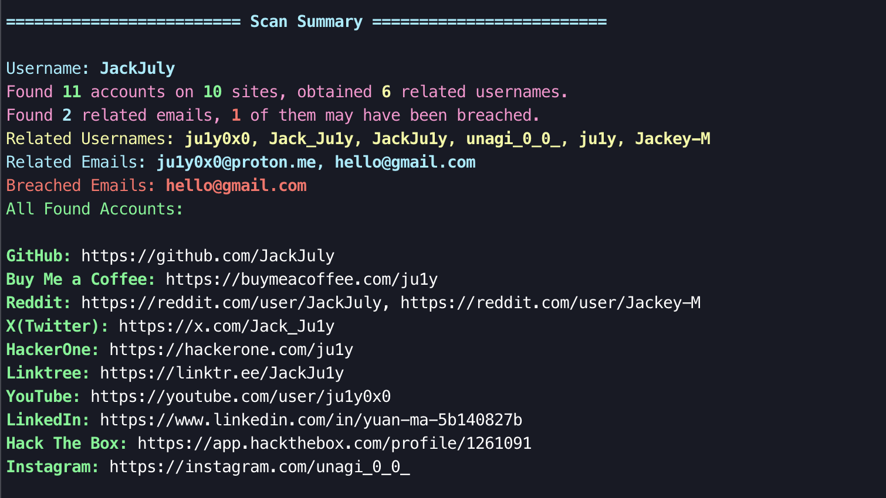

# Linkook

English | [中文](README_zh.md)

**Linkook** is an OSINT tool for discovering **linked/connected** social accounts and associated emails across multiple platforms using a single username. It also supports exporting the gathered relationships in a Neo4j-friendly format for visual analysis.


**Main Features**

- Search social media accounts across multiple platforms based on a given username.
- Further retrieve interlinked social accounts, usernames, emails, and more.
- Use HudsonRock's Cybercrime Intelligence Database to check if related emails have been affected by cybercrime or info-stealer infections.
- Support exporting scan results to a Neo4j-friendly JSON format, allowing visualization of social accounts, usernames, emails, and their interconnect relationships in Neo4j.

## Installation

Use the following commands to install:

```
git clone https://github.com/JackJuly/linkook && cd linkook

pip install .
```

## Usage

### Basic

```
linkook <username>
```

### `--show-summary`

Choose whether to display a summary of the scan results.



### `--concise`

Choose whether to display the output in a concise format.


### `--check-breach`

Use HudsonRock's Cybercrime Intelligence Database to check whether the discovered email addresses have been compromised by cybercrime or info-stealing. If any data breach is found, the email address will be highlighted in red with '(breach detected)' in the output, and all detected emails will be listed in the Scan Summary.

```
...
Found Emails: notbreached@mail.com, breached@mail.com(breach detected)
...
...
========================= Scan Summary =========================
...
Breached Emails: breached@mail.com
```

### `--neo4j`

Export the query results as a JSON file compatible with Neo4j database imports, producing `neo4j_export.json`.

In Neo4j, use the **APOC** plugin to import the JSON data. The following **Cypher** code will import the data and, upon successful execution, return the counts of imported nodes and relationships.

```
CALL apoc.load.json("file:///neo4j_export.json") YIELD value
CALL {
  WITH value
  UNWIND value.nodes AS node
  CALL apoc.create.node(
    node.labels,
    apoc.map.merge({ id: node.id }, node.properties)
  ) YIELD node AS createdNode
  RETURN count(createdNode) AS nodesCreated
}
CALL {
  WITH value
  UNWIND value.relationships AS rel
  MATCH (startNode {id: rel.startNode})
  MATCH (endNode {id: rel.endNode})
  CALL apoc.create.relationship(startNode, rel.type, {}, endNode) YIELD rel AS createdRel
  RETURN count(createdRel) AS relsCreated
}
RETURN nodesCreated, relsCreated;
```

可使用`MATCH (n) RETURN n`查看所有结果及关联情况


### Other Options

**`--help`**: show help message.
**`--slient`**: Suppress all output and only show summary.
**`--scan-all`**: Scan all available sites in the provider.json file. If not set, only scan sites with `isConnected` set to true.
**`--print-all`**: Output sites where the username was not found.
**`--no-color`**: Output without color.
**`--browse`**: Browse to all found profiles in the default browser.
**`--debug`**: Enable verbose logging for debugging.
**`--output`**: Directory to save the results. Default is `results`.
**`--local`**: Force the use of the local provider.json file, add a custom path if needed. Default is `provider.json`.

## Comparison with Sherlock

[Sherlock](https://github.com/sherlock-project/sherlock) is a tool that finds social media accounts based on a specific username, and this project (Linkook) was partly inspired by it. However, Sherlock only checks each platform for that same username. If the same person uses different usernames on different platforms, Sherlock cannot thoroughly locate them. It may also detect accounts belonging to multiple unrelated individuals if they happen to share the searched username.

In contrast, Linkook can go one step further: from each discovered social account, it can continue searching other **linked** accounts even if they use different usernames and perform these lookups recursively to build a more comprehensive view of the user.

Additionally, Linkook supports exporting this data into Neo4j for **visualization**, making it easier to see associations between usernames, accounts, and emails. By examining these connections, you can better identify a user’s genuine social media presence and filter out unconnected accounts.

## Contributing

Please refer to the [CONTRIBUTING.md](CONTRIBUTING.md) document for more details.

## Support

[](https://buymeacoffee.com/ju1y)
