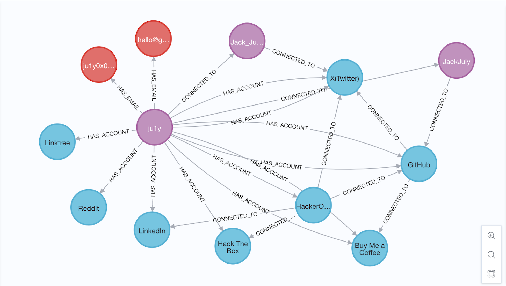

# Linkook

[English](README.md) | 中文

**Linkook** 是一款 OSINT 工具，可通过单一用户名在多个社交平台中发现**相互关联的**社交账户及其关联邮箱。它还支持将收集到的关联信息导出为适用于 Neo4j 的格式，以便进行可视化分析。


**主要功能**

- 通过给定的用户名在多个社交平台中搜索枚举社交账号
- 进一步检索相互关联的其他社交账号、用户名、Email 等
- 可使用 HudsonRock's Cybercrime Intelligence Database,查询关联的 Email 是否受到网络犯罪和信息窃取的影响
- 支持将扫描结果导出为 neo4j 友好的 JSON 数据格式，可使用 neo4j 可视化展示社交账号、用户名、Email 及其相互关联情况

## 安装说明

使用以下命令安装：

1. 下载本 repo

```shell
git clone https://github.com/JackJuly/linkook
cd linkook
```

2. 直接运行 `Linkook`

```shell
python -m linkook {username}
```

3. 或安装 `Linkook`

```shell
python setup.py install
```

或使用 `pip`

```shell
pip install .
```

然后运行

```shell
linkook {username}
```

## 使用说明

### `--show-summary`

选择是否展示扫描结果的总结


### `--concise`

选择是否简洁显示输出内容


### `--check-breach`

使用 HudsonRock's Cybercrime Intelligence Database,查询获取到的 Email 是否受到网络犯罪和信息窃取的影响。如果发现存在信息泄漏，则在输出显示时，Email 会标识为红色，并提示 (breach detected),在 Scan Summary 也会列出所有检测到的 Emails。

```
...
Found Emails: notbreached@mail.com, breached@mail.com(breach detected)
...
...
========================= Scan Summary =========================
...
Breached Emails: breached@mail.com
```

### `--neo4j`

将查询结果导出为支持 neo4j 数据库导入的 JSON 格式。输出结果为`neo4j_export.json`

在 neo4j 中，使用**APOC**插件将 JSON 数据导入。以下为导入数据的**Cypher**代码，运行成功后会返回导入节点数和导入关系数。

```cypher
CALL apoc.load.json("file:///neo4j_export.json") YIELD value
CALL {
  WITH value
  UNWIND value.nodes AS node
  CALL apoc.create.node(
    node.labels,
    apoc.map.merge({ id: node.id }, node.properties)
  ) YIELD node AS createdNode
  RETURN count(createdNode) AS nodesCreated
}
CALL {
  WITH value
  UNWIND value.relationships AS rel
  MATCH (startNode {id: rel.startNode})
  MATCH (endNode {id: rel.endNode})
  CALL apoc.create.relationship(startNode, rel.type, {}, endNode) YIELD rel AS createdRel
  RETURN count(createdRel) AS relsCreated
}
RETURN nodesCreated, relsCreated;
```

可使用`MATCH (n) RETURN n`查看所有结果及关联情况



### 其他选项

**`--help`**: 显示帮助信息。

**`--silent`**: 禁用所有输出，仅显示摘要。

**`--scan-all`**: 扫描 provider.json 中全部可用站点。如果未指定，则仅扫描标有 `isConnected` 为 true 的站点。

**`--print-all`**: 输出用户名不存在的站点信息。

**`--no-color`**: 输出中不使用颜色。

**`--browse`**: 在默认浏览器中打开所有已发现的个人资料链接。

**`--debug`**: 启用调试级别日志并详细输出。

**`--output`**: 指定保存结果的目录。默认值为 `results`。

**`--local`**: 强制使用本地的 provider.json 文件，并可添加自定义路径。默认值为 `provider.json`。

## 对比 Sherlock

[Sherlock](https://github.com/sherlock-project/sherlock) 是一个优秀的工具，可以基于用户名查找社交媒体账号，本项目（Linkook）也受到其启发。但 Sherlock 存在一些局限性：

- 仅在各个平台上搜索相同的用户名。
- 如果用户在不同平台使用不同的用户名，可能会遗漏账号。
- 如果多个无关用户共享相同的用户名，可能会错误地包含这些账号。

相比之下，**Linkook** 能够更进一步：

- **递归搜索** 每个已发现的社交账号的**关联账号**，即使使用不同的用户名也能识别。
- 提供更全面的用户在线信息视图，包括邮箱信息等。
- 支持将扫描结果导出为 **Neo4j 兼容的 JSON 格式** 进行**可视化**，方便分析用户名、账号和邮箱之间的关联，筛选出真正相关的账号并过滤无关信息。

## 贡献文档

`Linkook`的工作方式及如何贡献，请参考[CONTRIBUTING.md](CONTRIBUTING.md)

## 支持作者

[](https://buymeacoffee.com/ju1y)
